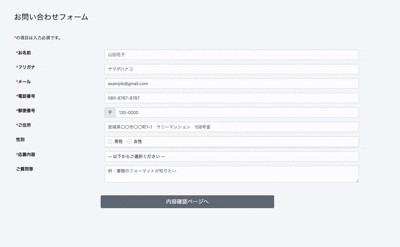
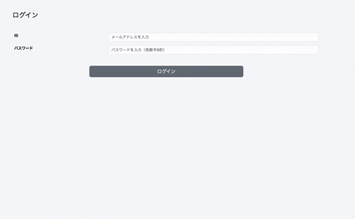

# Contact Form & Dashboard

🇬🇧 English | [🇯🇵 Japanese](README.js.md)

A contact management system built with PHP and MySQL.

Users can submit enquiries through a contact form, while administrators can view and search submitted enquiries from the administration panel.

Built with PHP, MySQL, HTML, Bootstrap, jQuery, and JavaScript.

## Preview

### Public Contact Form



### Administrator Login


## Background
This project was created to learn PHP form handling, validation, and database integration.

The primary focus was on input validation, formatting data before storing and displaying it, and implementing reliable database connectivity.

## Features

### Contact form submission
Users can easily submit enquiries through the contact form.

### Automatic address completion
Entering a Japanese postcode automatically fills in the address using [yubinbango.js](https://github.com/yubinbango/yubinbango).

### View submitted enquiries
Administrators can log in to the administration panel to view enquiries.

### Search enquiries
Search functionality is available within the administration panel.

### Sort enquiries
Enquiries can be sorted in ascending or descending order by submission date.

### Read / Unread status
Unread enquiries are highlighted so they can be identified at a glance.

## Tech Stack

### Frontend
- HTML
- JavaScript
- jQuery

### Backend
- PHP
- MySQL

### Libraries
- Bootstrap
- [yubinbango.js](https://github.com/yubinbango/yubinbango)

## Technology Choices
To focus on understanding PHP form processing and database integration, I chose not to use a framework.

Bootstrap was adopted to reduce development time and provide a consistent UI.

For Japanese address auto-completion, I selected [yubinbango.js](https://github.com/yubinbango/yubinbango) because it is lightweight, easy to integrate, and specifically designed for Japanese addresses.

## System Design
The UI uses Bootstrap's secondary colour as the primary theme to create a clean and intuitive interface.

Error messages and unread indicators use red to draw attention to important information.

The administration panel includes a fixed left-side navigation and pagination. Limiting the list to five enquiries per page improves readability while keeping frequently used controls visible.

## Implementation Highlights
Database connection logic was centralised to avoid duplication across the application.

Configuration values were separated into environment variables, allowing database credentials to be changed without modifying application logic.

Session management is used throughout the application to preserve user input during multi-step form submission and to manage administrator authentication.

User input and database values are escaped before rendering HTML to ensure safe output.

## Challenges & Solutions
One challenge was preserving form data when validation failed or when users navigated back to a previous page.

To solve this, session data is used to maintain the enquiry throughout the submission process until it is completed.

The same session-based approach is used for administrator authentication, maintaining the login state until the user signs out.

## Security
- Passwords are securely stored using `password_hash()`.
- Authentication is performed using `password_verify()`.
- Prepared statements are used to prevent SQL injection.
- User input is escaped before output to mitigate XSS attacks.
- Administrative pages are protected by session-based authentication.

## Mail Setup
This project uses [Mailtrap](https://mailtrap.io/) for email testing in the local development environment.

To enable email sending:

1. Create a [Mailtrap](https://mailtrap.io/) account.
2. Create a testing inbox.
3. Copy `.env.example` to `.env`.
4. Add your Mailtrap SMTP credentials to `.env`.

Example:

```
MAIL_HOST=sandbox.smtp.mailtrap.io
MAIL_PORT=2525
MAIL_USERNAME=your_username
MAIL_PASSWORD=your_password
```

Emails are captured by [Mailtrap](https://mailtrap.io/) and are not delivered to real email addresses.

## Demo Account

User registration is intentionally unavailable, as this project is intended solely as a personal portfolio.

Use the following credentials to sign in to the administration pages:

Email:

```text
test1234@gmail.com
```

Password:

```text
test1234
```

To see the read/unread status in action, first submit a new enquiry using the public contact form. Then sign in to the administration pages and open the newly submitted enquiry. This makes it easier to observe how the read/unread status changes.

## Local Development

1. Clone this repository.
2. Import `database/mails.sql` and `database/users.sql` into MySQL.
3. Configure the database connection in `config/init.php`.
4. Start Apache and MySQL.
5. Access the application through your local development environment.

## Environment Variables

The following environment variables are required.

```
DB_HOST=
DB_NAME=
DB_USER=
DB_PASSWORD=

MAIL_HOST=
MAIL_PORT=
MAIL_USERNAME=
MAIL_PASSWORD=
```

## Future Improvements

- Add user registration.
- Introduce automated testing with PHPUnit.
- Improve the database design through further normalisation.
- Make the administration pages fully responsive.
- Define a clearer target audience and real-world use case, review the application's specifications accordingly, and deploy it to a production environment.

## License & Usage
This repository is publicly available for portfolio purposes.

The source code is not open source and is provided solely to demonstrate my development work and technical skills.

## Explore More Projects
You can find more of my projects on my GitHub profile.

👉🏻 https://github.com/htm823